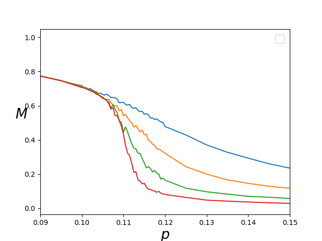
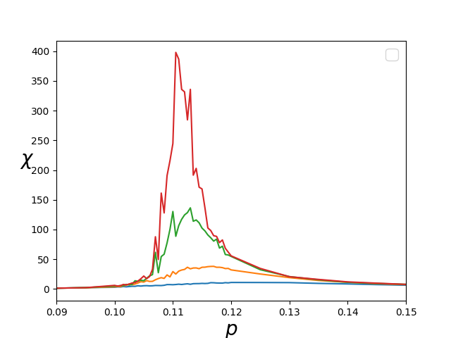
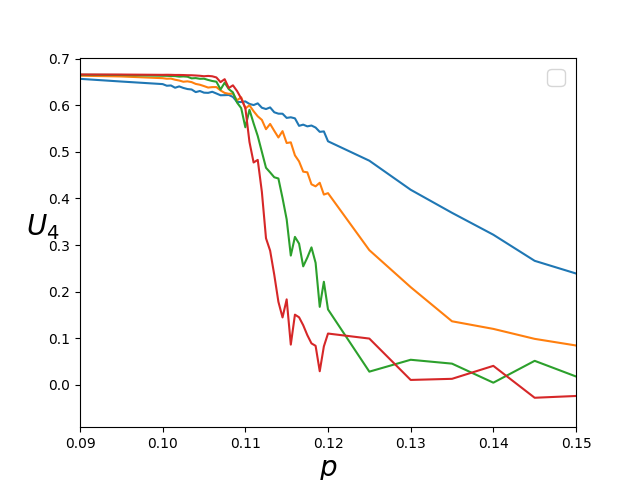

# Monte Carlo Simulation of Majority Vote Model

Monte Carlo simulation of the Majority Vote Model 

## Majority Vote Model

The MV model is defined in an arbitrary lattice topology,
in which each node $i$ of degree $k_i$ is attached to a spin
variable, $\sigma_i$, that can take the values $sigma_i = \pm 1$. 
In the original case, with probability $1-f$ each node $i$ tends 
to align itself with its local neighborhood majority, and with 
complementary probability $$ , the majority rule is not followed. 
(Text taken from the reference [1]).

## General Results

  

## References

[1] Pedro E. Harunari, M. M. de Oliveira, and C. E. Fiore
Phys. Rev. E **96**, 042305.

[2] ALLEN, M. P.; TILDESLEY, D. J. Computer Simulation of Liquids. Oxford science
publications. Oxford University Press, USA, 1989.